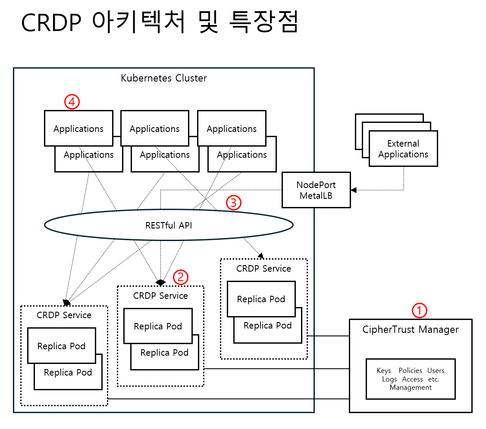

# CRDP Java Simple Demo

**단 하나의 파일**로 CRDP API 테스트하기!

## ✨ 특징

- 🚀 **하나의 파일** - SimpleDemo.java 만으로 모든 기능
- 📦 **외부 의존성 없음** - 순수 Java만 사용
- ⚡ **빠른 실행** - 컴파일하고 바로 실행

### CRDP 특징


### CRDP 구조도



## 요구사항

- Java 8+

## 30초 시작

```bash
# 다운로드
git clone https://github.com/sjrhee/crdp_java_sample.git
cd crdp_java_sample

# 빌드 & 실행
./build.sh
./run.sh
```

## 출력 예시

```
=== CRDP 간단 데모 ===
서버: 49.50.138.96:32082
정책: P01
데이터: 1234567890123

1. 데이터 보호 중... 성공: 435b7e99fdf33e10a29e4708710cacc2
2. 데이터 복원 중... 성공: 1234567890123

3. 검증 결과:
   원본: 1234567890123
   복원: 1234567890123
   일치: 예
```

## 옵션

```bash
java SimpleDemo --help                       # 도움말
java SimpleDemo --data 9876543210987         # 다른 데이터
java SimpleDemo --host 49.50.138.96          # 다른 서버
java SimpleDemo --port 32082                  # 포트 번호
java SimpleDemo --policy P01               # 다른 정책
java SimpleDemo --host 49.50.138.96 --port 32082 --policy P01 --data 1234567890123  # 여러 옵션 조합
```

## 설정 관리 (Properties 파일)

### SimpleDemo.properties 파일

기본값을 외부 설정 파일에서 관리할 수 있습니다:

```properties
# 서버 주소
host=49.50.138.96

# 서버 포트
port=32082

# 보호 정책명
policy=P01

# 테스트 데이터
data=1234567890123

# HTTP 타임아웃 (초 단위)
timeout=10
```

### 사용 방법

1. **기본값 사용** (properties 파일 적용됨)
```bash
./run.sh
```

2. **설정 파일 변경 후 실행**
```bash
# SimpleDemo.properties 파일 수정
vim SimpleDemo.properties

# 변경된 설정으로 실행 (재컴파일 불필요)
./run.sh
```

3. **명령행 옵션으로 덮어쓰기** (properties 설정보다 우선)
```bash
./run.sh --data "다른데이터"        # properties의 data 값 무시
./run.sh --host 192.168.1.1        # properties의 host 값 무시
```

### 우선순위

**명령행 옵션 > properties 파일 > 하드코딩된 기본값**

- 명령행에서 지정한 옵션이 최우선
- properties 파일의 설정값이 그 다음
- properties 파일이 없으면 코드의 기본값 사용

### 환경별 설정

서로 다른 환경에 맞는 properties 파일을 관리할 수 있습니다:

```bash
# 개발 환경
cp SimpleDemo-dev.properties SimpleDemo.properties
./run.sh

# 운영 환경
cp SimpleDemo-prod.properties SimpleDemo.properties
./run.sh
```

## 파일 구조

```
.
├── SimpleDemo.java            # 🎯 모든 기능이 여기 있음!
├── SimpleDemo.properties      # ⚙️ 설정 파일 (properties)
├── build.sh                   # 빌드 스크립트
└── run.sh                      # 실행 스크립트 (빌드 후 생성)
```

## 수동 실행

```bash
# 컴파일
javac SimpleDemo.java

# 실행
java SimpleDemo
java SimpleDemo --data "1234567890123"
```

## 코드 설명

`SimpleDemo.java` 하나의 파일에:
- ✅ HTTP 클라이언트
- ✅ JSON 파싱
- ✅ CLI 옵션 처리
- ✅ CRDP API 호출 (protect/reveal)

## Protect/Reveal 구현 방법

### 1️⃣ HTTP POST 요청 (`post()` 메서드)

```java
private static String post(String urlString, String json) {
    try {
        URL url = new URL(urlString);
        HttpURLConnection conn = (HttpURLConnection) url.openConnection();
        
        // HTTP 설정
        conn.setRequestMethod("POST");
        conn.setRequestProperty("Content-Type", "application/json");
        conn.setDoOutput(true);
        conn.setConnectTimeout(10000);  // 10초 타임아웃
        
        // JSON 요청 전송
        try (OutputStream os = conn.getOutputStream()) {
            os.write(json.getBytes(StandardCharsets.UTF_8));
        }
        
        // 응답 읽기
        int status = conn.getResponseCode();
        InputStream is = (status >= 200 && status < 300) 
            ? conn.getInputStream() 
            : conn.getErrorStream();
        
        // 응답 본문 파싱
        StringBuilder response = new StringBuilder();
        try (BufferedReader br = new BufferedReader(
            new InputStreamReader(is, StandardCharsets.UTF_8))) {
            String line;
            while ((line = br.readLine()) != null) {
                response.append(line);
            }
        }
        
        return response.toString();
    } catch (Exception e) {
        System.err.println("HTTP 오류: " + e.getMessage());
        return null;
    }
}
```

**핵심 포인트:**
- `HttpURLConnection` 사용 (외부 라이브러리 불필요)
- JSON 데이터를 UTF-8로 인코딩하여 전송
- 성공(200-299)과 오류(4xx, 5xx) 응답 구분 처리

### 2️⃣ Protect (데이터 보호)

```java
private static String protect(String host, int port, String policy, String data) {
    String url = "http://" + host + ":" + port + "/v1/protect";
    String json = "{\"protection_policy_name\":\"" + policy 
        + "\",\"data\":\"" + data + "\"}";
    String response = post(url, json);
    return extractValue(response, "protected_data");
}
```

**요청 JSON 형식:**
```json
{
  "protection_policy_name": "P01",
  "data": "1234567890123"
}
```

**응답 JSON 형식:**
```json
{
  "protected_data": "435b7e99fdf33e10a29e4708710cacc2"
}
```

**프로세스:**
1. 정책 이름과 보호할 데이터를 JSON으로 포장
2. `/v1/protect` 엔드포인트에 POST 요청
3. 응답에서 `protected_data` 필드 추출 (암호화/토큰화된 값)

### 3️⃣ Reveal (데이터 복원)

```java
private static String reveal(String host, int port, String policy, String protectedData) {
    String url = "http://" + host + ":" + port + "/v1/reveal";
    String json = "{\"protection_policy_name\":\"" + policy 
        + "\",\"protected_data\":\"" + protectedData + "\"}";
    String response = post(url, json);
    return extractValue(response, "data");
}
```

**요청 JSON 형식:**
```json
{
  "protection_policy_name": "P01",
  "protected_data": "435b7e99fdf33e10a29e4708710cacc2"
}
```

**응답 JSON 형식:**
```json
{
  "data": "1234567890123"
}
```

**프로세스:**
1. 정책 이름과 보호된 데이터를 JSON으로 포장
2. `/v1/reveal` 엔드포인트에 POST 요청
3. 응답에서 `data` 필드 추출 (복원된 원본 데이터)

### 4️⃣ JSON 파싱 (`extractValue()` 메서드)

```java
private static String extractValue(String json, String key) {
    if (json == null || json.trim().isEmpty()) return null;
    
    // JSON 객체 범위 찾기
    int startBrace = json.indexOf('{');
    int endBrace = json.lastIndexOf('}');
    if (startBrace == -1 || endBrace == -1 || startBrace >= endBrace) 
        return null;
    
    String content = json.substring(startBrace + 1, endBrace).trim();
    
    // "key": 패턴 찾기
    String keyPattern = "\"" + key + "\":";
    int keyIndex = content.indexOf(keyPattern);
    if (keyIndex == -1) return null;
    
    int valueStart = keyIndex + keyPattern.length();
    
    // 공백 건너뛰기
    while (valueStart < content.length() 
        && Character.isWhitespace(content.charAt(valueStart))) {
        valueStart++;
    }
    
    if (valueStart >= content.length()) return null;
    
    // 문자열 값 추출 (따옴표로 감싼 경우)
    char firstChar = content.charAt(valueStart);
    if (firstChar == '"') {
        valueStart++;
        int valueEnd = valueStart;
        while (valueEnd < content.length() 
            && content.charAt(valueEnd) != '"') {
            if (content.charAt(valueEnd) == '\\') {
                valueEnd++;  // 이스케이프 문자 건너뛰기
            }
            valueEnd++;
        }
        return content.substring(valueStart, valueEnd);
    }
    
    return null;
}
```

**JSON 파싱 전략:**
- 외부 JSON 라이브러리 사용 안 함 (gson, jackson 등)
- 문자열 기반 파싱으로 단순성 유지
- 이스케이프 문자(`\"`) 처리
- 쉼표와 중괄호를 경계로 하여 값 추출

### 완전한 워크플로우

```
1. 입력 데이터: "1234567890123"
   ↓
2. Protect API 호출 (암호화/토큰화)
   URL: http://49.50.138.96:32082/v1/protect
   JSON: {"protection_policy_name":"P01","data":"1234567890123"}
   ↓
3. 보호된 데이터 수신: "435b7e99fdf33e10a29e4708710cacc2"
   ↓
4. Reveal API 호출 (복호화/디토큰화)
   URL: http://49.50.138.96:32082/v1/reveal
   JSON: {"protection_policy_name":"P01","protected_data":"435b7e99fdf33e10a29e4708710cacc2"}
   ↓
5. 복원된 데이터 수신: "1234567890123"
   ↓
6. 검증: 원본 == 복원 ✓
```

### 에러 처리

```java
// HTTP 오류 처리
if (status < 200 || status >= 300) {
    System.err.println("실패: HTTP " + status);
    return null;
}

// JSON 파싱 실패 처리
if (protectedData == null) {
    System.err.println("실패: 보호된 데이터를 찾을 수 없음");
    return null;
}

// 네트워크 오류 처리
catch (Exception e) {
    System.err.println("오류: " + e.getMessage());
}
```

## 관련 링크

- [CRDP API 문서](https://thalesdocs.com/ctp/con/crdp/latest/crdp-apis/index.html)
- [GitHub 저장소](https://github.com/sjrhee/crdp_java_sample)
