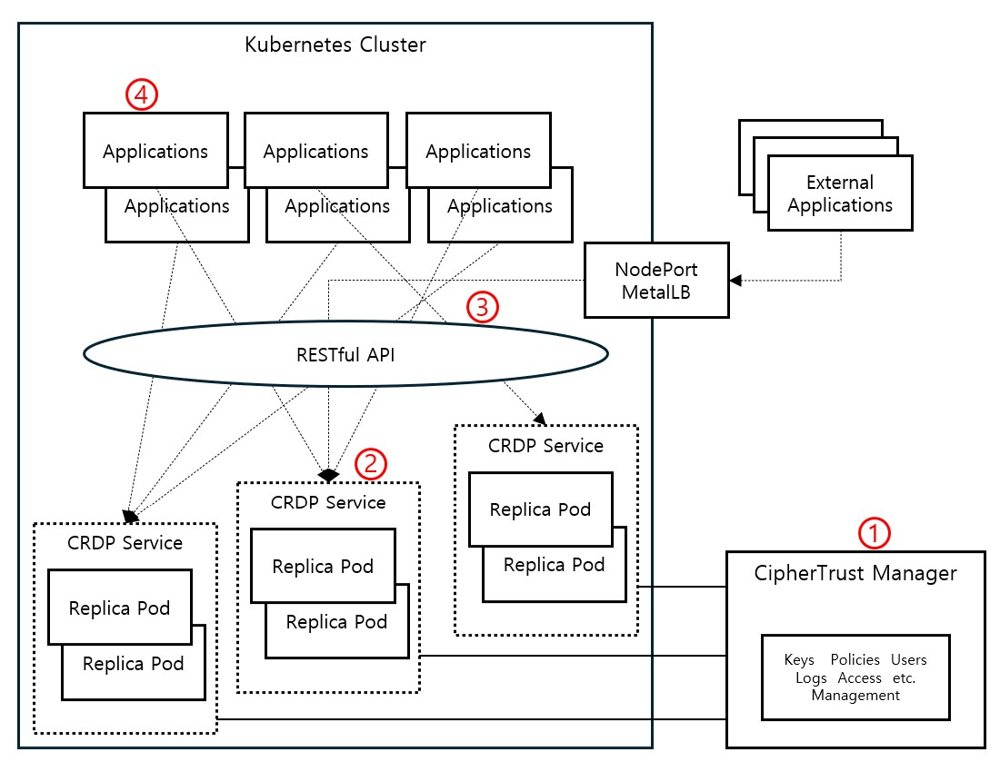

# CipherTrust CRDP 정책 핵심 요약

## 1. 보안 정책

- **암호화 키 선택**: 사용 권한을 부여한 AES 대칭키(성능우선)를 적용

- **암호화 형식**: 형태유지암호화(FPE) 알고리즘 등 다양한 방식 지원

- **버전관리**: 적용 여부 선택 가능하며 버전 표시(내/외부) 방법도 선택 가능
  - **장점**: 정책 변경 시 버전 관리를 지원하여 정책 변경 전 암호화 데이터도 복호화 가능
  - **단점**: 암호화 데이터에 포함되는 버전관리 데이터로 인한 코드 복잡도 증가

- **마스킹 포멧 선택**: 마스킹 범위를 제외한 암호화 (FPE에서 효율적)

- **암호화 적용 문자셋**: 아스키 코드 혹은 utf-8 코드 범위 (FPE에서 필요)

- **접근 정책 선택**: 접근정책의 추가정책을 적용

## 2. 접근 정책

- **허용 사용자 그룹 선택**

- **불허된 사용자 접근 시 처리 방법**: 오류, 암호문, 마스킹, 평문 중 선택

- **주의**: Default를 평문으로 선택하면 접근 정책은 무의미

## 3. 사용자 정책

- **사용자 그룹 생성**

- **사용자 입력**: CRDP 접근 시 사용할 임의의 사용자 (CipherTrust 사용자 계정과는 별개)

- **사용자 전달 방법**: JWT 또는 json의 username 항목으로 전달
  - **JWT**: 관리자가 생성, 서명하여 개발자에 전달하여 사용
  - **json**: 개발자가 임의 사용자값을 넣어 사용

## 4. JWT 적용 방안

- **JWT 생성**: 비대칭키의 개인키로 헤더와 Payload를 서명한 `header.payload.signature` 형식으로 JWT 생성

- **API 요청**: RESTful API 요청 헤더에 JWT를 포함해 CRDP 서비스로 전달

- **서명 검증**: CRDP 서버에 공개키를 등록하면 CRDP는 JWT 서명 검증 후 payload 값을 추출

- **사용자 특정**: payload의 특정 claim(sub)에서 값을 추출하여 사용자를 특정

- **우선순위**: json에 포함한 사용자 데이터보다 JWT가 우선함

- **검증 필수**: JWT를 CRDP 서버에서 활성화한 경우, JWT 서명검증과 유효일시를 통과해야 API가 작동

## 5. RESTful API 요소

| 요소 | 설명 |
|------|------|
| Authorization Header | `Authorization: Bearer $JWT_TOKEN` |
| Protect 엔드포인트 | `https://crdp-url/v1/protect` |
| Reveal 엔드포인트 | `https://crdp-url/v1/reveal` |
| 정책명 | `"protection_policy_name"` |
| 보호 데이터 | `"data"` 또는 `"protected_data"` |

## 6. 참고

- Web UI JWT 발생기 제공됨
- 접근 정책과 사용자 정책을 조합하여 세밀한 보안 등급별 제어 가능

## 7. 구조 및 특징

### CRDP 구조도

### CRDP 특징

#### 1) CipherTrust Manager (CTM)

- 전사적으로 분산된 다양한 형태의 데이터 보안을 중앙에서 통합 관리하는 플랫폼
- 암호화 정책, 키 수명주기, 접근 제어 정책을 생성하고 CRDP 서비스에 배포
- 형태유지암호화(FPE), 부분 마스킹(예: 주민번호 앞자리 비암호화) 등 세밀한 데이터 보호 정책 정의 가능
- 감사(Audit) 및 키 사용 이력 관리로 국제 보안 규제 준수 지원

#### 2) CRDP (CipherTrust RESTful Data Protection) Service

- CTM에서 정의한 정책에 따라 애플리케이션 요청 시 암·복호화 수행
- Thales에서 컨테이너 형태로 제공하며 Docker, Kubernetes, Helm 배포 환경 모두 지원
- Replica Pod 구조를 통한 수평 확장(Scale-out)으로 부하분산 및 고가용성 보장
- 정책 기반 암호화 수행으로 개발자가 키나 알고리즘을 직접 다룰 필요 없음

#### 3) RESTful API

- CRDP 서비스의 Endpoint를 통해 정책 이름, 평문, 암호문 등의 JSON 요청/응답 수행
- 데이터 보호 정책 단위로 통신하며, 응답은 정책에 맞는 암호화 결과 반환
- 대량 데이터 변환 시 Bulk Endpoint를 이용해 처리 성능 향상
- 표준화된 REST 구조로 외부 시스템 및 클라우드 서비스와의 연동 용이

#### 4) Application

- 데이터베이스 조회·저장·수정 시점에 RESTful API 호출을 통해 암호화 또는 복호화 수행
- 소스 코드에서 필요한 부분만 호출하므로 기존 비즈니스 로직에 최소한의 수정으로 적용 가능
- 모든 종류의 데이터베이스 및 애플리케이션 환경에 적용 가능
- 자체 암호화 방식 대비 보안성·유연성·운영 효율성이 우수